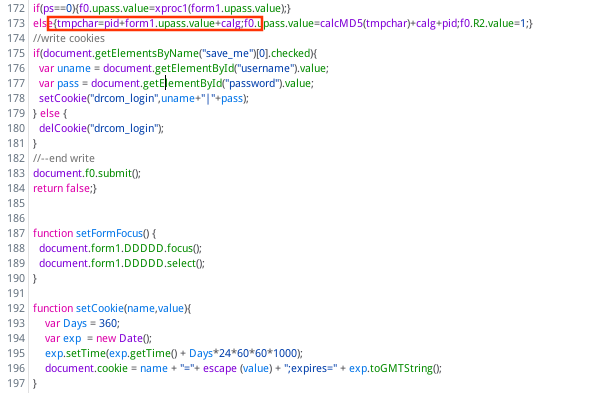
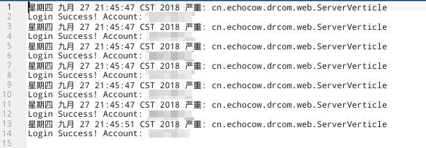

# DrcomTools

Drcom 校园网爆破工具

## 简述

首先感谢两位大佬 FGR，LM 带我，告诉我规律，然后自己抓包分析，解密密码，在得出这个程序，用于暴力破解校园网教师网。

__不过值得注意的是，我删除了网址（每个学校情况不一样）,同时删除了解密方式，请自行抓包分析。。。__

运行此程序之前，你必须要知道你们教师网的帐号和密码的规律，并知道那几个数字段较多。然后抓包分析加密方式，我们的是加了几个数字然后 md5 加密，你只需要抓包后反解密就大概能找到规律了。

可以在运行一个 web 的时候，运行多个 server ，测试同时开五个 server，一个 web，十分钟爆破十万个帐号（因电脑性能而异）

> 注意，最好不要跑太多，不然怕被查水表。

## 技术选型

- 核心框架：vertx-core
- 依赖管理：maven
- 开发工具：idea
- **java：jdk 8（务必）** 
- web：vertx-web
- 集群：vertx-hazelcast
- 日志：JUL

## 如何运行

1. 找到校园网登录网页，见下方的截图，复制网址至 cn.echocow.drcom.utils.Constant ，替换 url 中的字符串
2. 先运行 server，再运行 web，可以直接在 cn.echocow.drcom.web 运行，也可以运行多次 cn.echocow.drcom.Application。
3. 生成的日志文件存放于当前用户的家目录下，windows 见 C：//user/用户名/Drcom.log，linux 见 /home/用户名/Drcom.log，运行多个会在log加.1，例如Drcom.log.1、Drcom.log.2。

## 截图

我们的 drcom 官网：

我校加密方式：

运行结果：

## 免责申明

本程序仅供技术交流，请勿用于商业及非法用途，如产生法律纠纷与本人无关！

CREATE BY [ECHOCOW](https://echocow.cn)